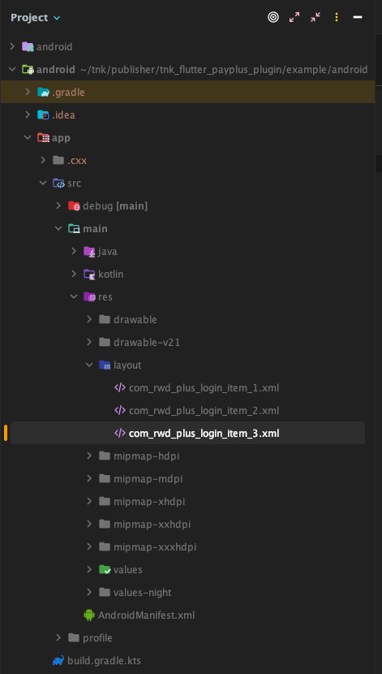

### Manifest 설정하기

android 프로젝트의 manifest파일에 다음과 같은 설정이 필요합니다.

#### 권한 설정

add permission to your AndroidManifest.xml file.
```xml
// 인터넷
<uses-permission android:name="android.permission.INTERNET" />
// 동영상 광고 재생을 위한 wifi접근
<uses-permission android:name="android.permission.ACCESS_WIFI_STATE" />
// 광고 아이디 획득
<uses-permission android:name="com.google.android.gms.permission.AD_ID"/>
```

tnk Application ID 설정하기
```xml
<application>

    <meta-data android:name="tnkad_app_id" android:value="your-application-id-from-tnk-site" />

</application>
```

Activity 추가 
광고 목록을 띄우기 위한 Activity를 아래와 같이 설정합니다. 
이때 scheme의 값을 tnkrwd+매체번호의 조합으로 설정 하시기 바랍니다. (해당 설정에 대해서는 영업팀에 문의 바랍니다.)

```xml
<!-- 카카오 로그인 activity -->
<activity
        android:name="com.tnkfactory.ad.rwdplus.kakao.scene.RwdPlusLoginActivity"
        android:exported="true"
        android:launchMode="singleTask"
        android:screenOrientation="portrait"
        android:windowSoftInputMode="adjustResize"
        android:theme="@style/Theme.AppCompat.DayNight.NoActionBar">

    <intent-filter android:autoVerify="true">
        <action android:name="android.intent.action.VIEW"/>

        <category android:name="android.intent.category.DEFAULT"/>
        <category android:name="android.intent.category.BROWSABLE"/>
        <!-- tnkrwd100014://payplus -->
        <data android:host="payplus" android:scheme="tnkrwd{매체아이디}"/>
    </intent-filter>
</activity>

<!-- 광고 목록 activity -->
<activity 
    android:name="com.tnkfactory.ad.AdWallActivity" 
    android:exported="true" 
    android:screenOrientation="portrait" 
    android:theme="@style/Theme.AppCompat.DayNight.NoActionBar" 
    android:windowSoftInputMode="adjustResize"/>
```

### 라이브러리 등록
TNK SDK는 Maven Central에 배포되어 있습니다.

프로젝트 파일 내에 {projectroot}/android/build.gradle.kts 파일이 있습니다.

build.gradle.kts 에 아래와 같이 https://repository.tnkad.net:8443/repository/public/ 를 추가해 주시기 바랍니다.

**예시**
```gradle

allprojects {
    repositories {
        google()
        mavenCentral()
        maven (url="https://repository.tnkad.net:8443/repository/public/")
    }
}
```

앱 모듈 내에 {projectroot}/android/app/build.gradle.kts 파일이 있습니다.

build.gradle.kts 에 아래와 같이 의존성을 추가해 주시기 바랍니다.

**예시**
```gradle
android {
...

// databinding 추가 
   buildFeatures {
        dataBinding = true
    }
...
}
dependencies {
    implementation("androidx.appcompat:appcompat:1.6.1")
    implementation("com.tnkfactory:rwd_payplus:1.1.14")
    api("com.tnkfactory:rwd:8.08.09")
    implementation("androidx.constraintlayout:constraintlayout:2.1.3")
}
```

### Proguard 사용

Proguard를 사용하실 경우 Proguard 설정내에 아래 내용을 반드시 넣어주세요.

```
-keep class com.tnkfactory.** { *;}
```

### xml 리소스 추가 

res/layout 폴더에 다음과 같이 xml 리소스를 추가합니다.

[xml파일 다운로드](https://github.com/tnkfactory/tnk_flutter_payplus_plugin/tree/main/example/android/app/src/main/res/layout)

- com_rwd_plus_login_item_1.xml
- com_rwd_plus_login_item_2.xml
- com_rwd_plus_login_item_3.xml



