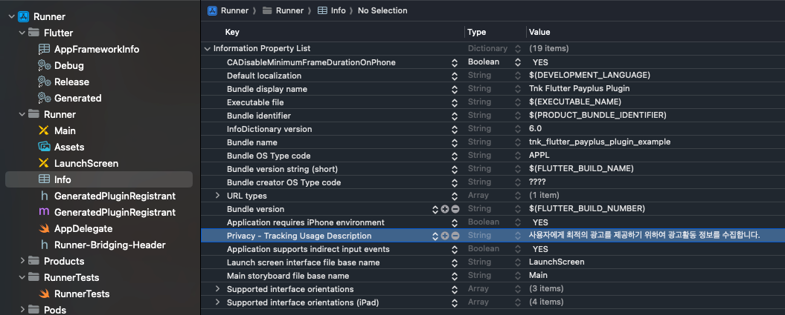
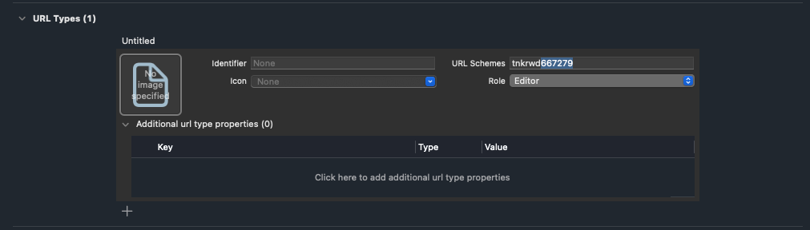

## iOS프로젝트 설정

##### info.plist 파일에 "Privacy - Tracking Usage Description" 을 추가합니다. 추가되는 문구는 앱 추적 동의 팝업 창에 노출됩니다.


##### 커스텀 스키마 xcode 등록 
- 카카오톡 앱과의 연동을 위해 카카오 앱에서 호출할 신규 스키마를 등록해야합니다. 

해당 과정은 카카오톡과 회원정보, 페이포인트와 연동하기 위한 필수 과정입니다.

Xcode > Target > Info > URL Types에 신규 Scheme를 등록합니다.

이때 등록할 Scheme값은 타사 앱에서 등록한 스키마와 겹치지 않게 고유한 값을 기입해 주시기 바랍니다.

아래의 이미지를 참고해 주시기 바랍니다.



##### 스키마 콜백 함수 연동 
카카오 페이앱으로 부터 로그인이 완료된 후 데이터를 넘겨받기 위한 스키마 처리 작업을 진행해야합니다. 
넘겨 받은 스키마 url을 처리하는 코드는 아래와 같습니다.

(아래 proceedUrlDelegate 함수의 결과가 false일 경우는 혜택플러스 url이 아닌 경우입니다.)

- AppDelegate.swift 파일에 아래와 같이 코드를 추가합니다.
```swift
import Flutter
import UIKit
import TnkRwdSdk2

@main
@objc class AppDelegate: FlutterAppDelegate {
    
    
//    var window: UIWindow?
    
    
    // 카카오 페이앱으로 부터 로그인이 완료된 후 데이터를 넘겨받기 위한 스키마 처리 작업을 진행
    override func application(_ app: UIApplication, open url: URL, options: [UIApplication.OpenURLOptionsKey : Any] = [:]) -> Bool {
        return KaKaoTnkRwdPlus.proceedUrlAppDelegate(open: url)
    }
    
    
    override func application(_ application: UIApplication, didFinishLaunchingWithOptions launchOptions: [UIApplication.LaunchOptionsKey: Any]?
    ) -> Bool {
        GeneratedPluginRegistrant.register(with: self)
        return super.application(application, didFinishLaunchingWithOptions: launchOptions)
    }
}
```

- SceneDelegate.swift 파일에 아래와 같이 코드를 추가합니다.
```swift
import TnkRwdSdk2
import UIKit

class SceneDelegate: UIResponder, UIWindowSceneDelegate {

    @available(iOS 13, *)
    func scene(_ scene: UIScene, openURLContexts URLContexts: Set<UIOpenURLContext>) {
        _ = KaKaoTnkRwdPlus.proceedUrlSceneDelegate(openURLContexts: URLContexts)
    }
}
```